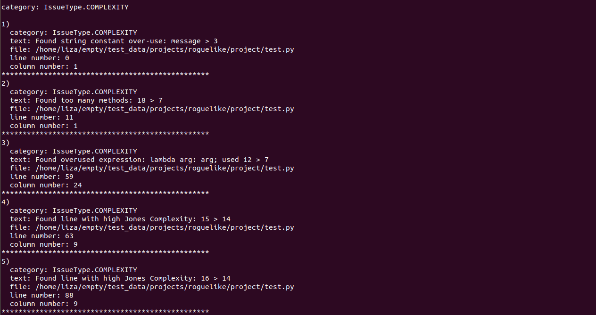

#  Code quality measurement tool

## Install

python 3.8 required

pip install -r requirements.txt

## Run 

python3.8 run.py \<tool_name\> \<path\>

where:

* tool_name: the name of the tool you want to run.

  tool_name = wemake-python-styleguide | cohesion | radon

* path: absolute path to directory or file with .py extension

## Example

test data: ./test_data/projects/roguelike

* python3.8 run.py wemake-python-styleguide ./test_data/projects/roguelike

* python3.8 run.py cohesion ./test_data/projects/roguelike

* python3.8 run.py radon ./test_data/projects/roguelike

